# Techcup-Futbol-Fronted

### link Figma
https://www.figma.com/design/HedKnnmSbBUYQYmwasHEjl/TechCup?node-id=0-1&m=dev&t=jJU8jxNaMPQR0e2y-1

## Pantalla Principal:
Presenta la página de inicio de la plataforma, con un menú superior para navegar entre equipos, partidos y competiciones.
Incluye secciones de noticias, redes sociales y finalistas, además de botones para iniciar sesión o unirse.

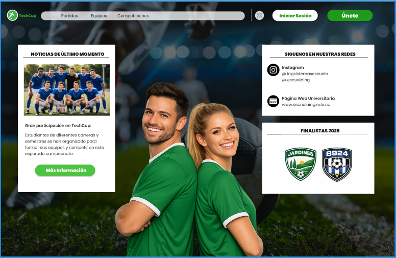

---

## Pantalla de Inicio de Sesión:
Presenta el formulario para acceder al sistema mediante correo y contraseña, con opciones como “Recuérdame”, 
recuperación de clave y acceso con Google.

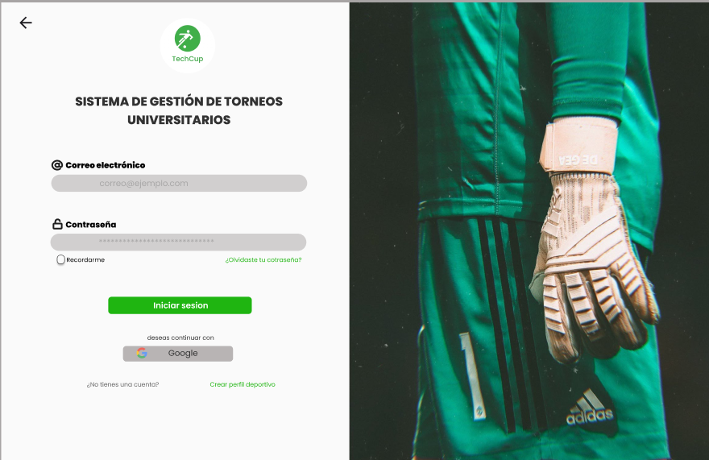

---

## Pantalla de Creación de Perfil Deportivo:
Permite registrar un nuevo perfil completando datos personales, rol, posición, correo, edad y contraseña. Incluye la 
opción de subir una foto y finalizar el registro con el botón “Crear perfil deportivo”.

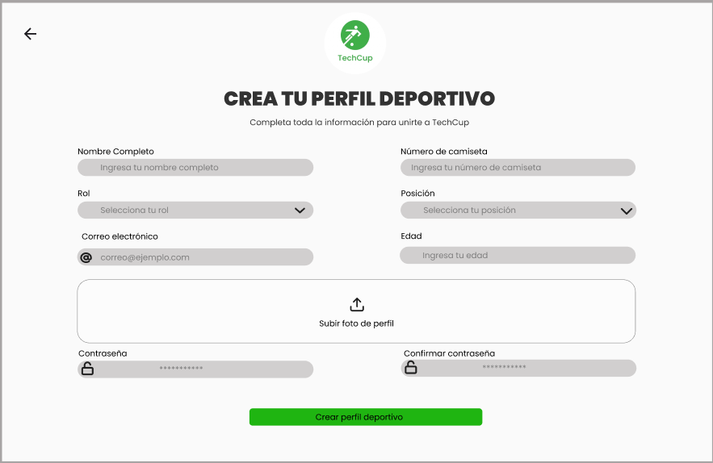

---

## Pantalla de Creación de Equipo (Rol Capitán):
Permite a los usuarios con rol de capitán crear su equipo ingresando el nombre, seleccionando colores del uniforme y 
subiendo el escudo. Finaliza con el botón “Continuar” para avanzar en la configuración.

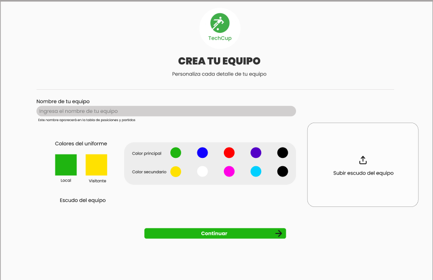

---

## Pantalla de Panel del Capitán:
Presenta las estadísticas principales del equipo, incluyendo victorias, empates, derrotas y posición. También muestra 
la información del equipo, los próximos partidos y un menú lateral y superior para una navegación más completa dentro de la plataforma.

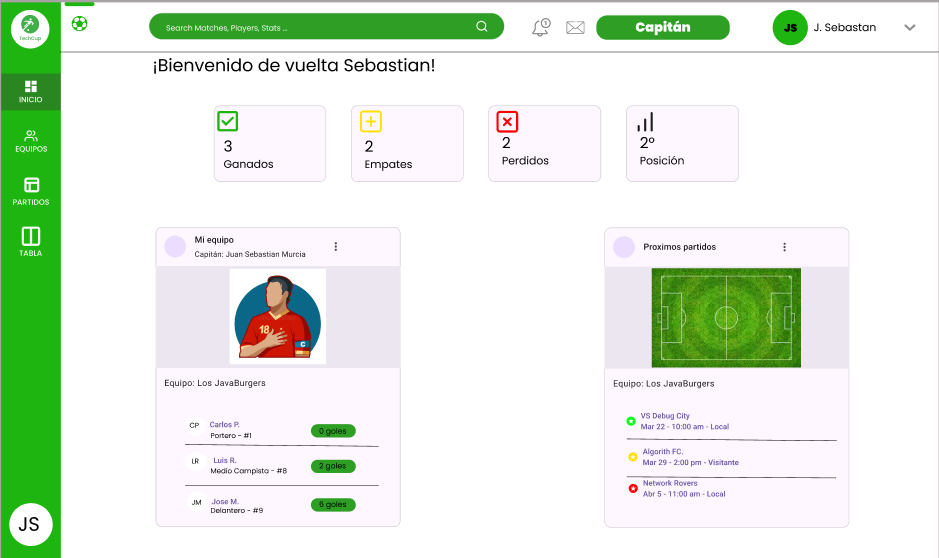

---

## Pantalla de Tabla de Posiciones:
Muestra la clasificación general del torneo con estadísticas completas por equipo. A la derecha se destacan reconocimientos 
como mejor jugador, defensa y ataque, mientras el menú lateral y superior permite navegar cómodamente por la plataforma.

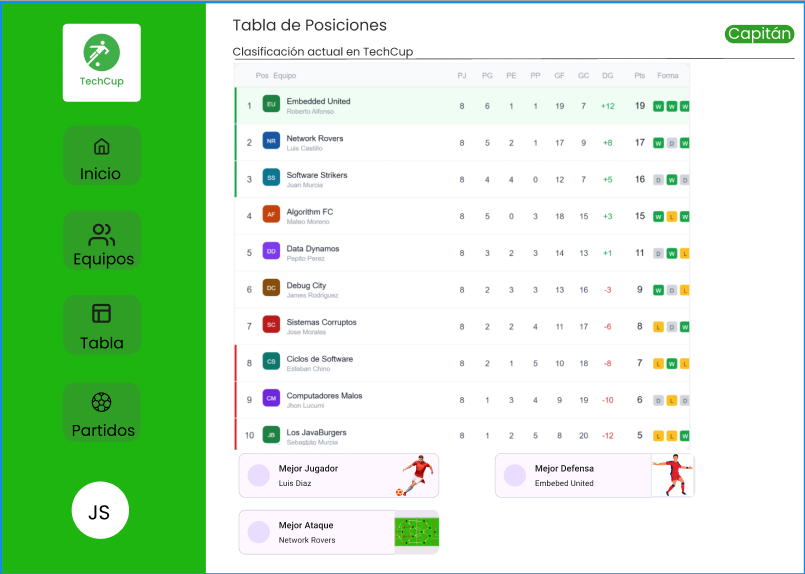

---

## Pantalla de Equipos Participantes:
Muestra el listado completo de los equipos inscritos en el torneo TechCup junto con el nombre del capitán y su escudo. 
Incluye un menú lateral y una barra superior que facilitan la navegación entre las distintas secciones de la plataforma.

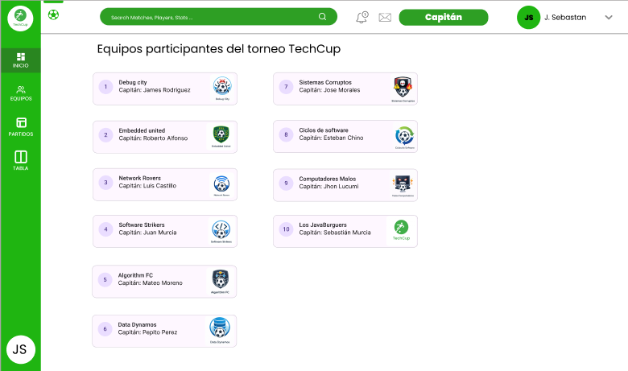

---

## Pantalla de Jornadas y Próximos Enfrentamientos (Capitán):
Presenta un calendario interactivo junto al listado de jornadas del torneo, indicando cuáles están finalizadas, en curso o próximas. 
A la derecha se muestran los enfrentamientos futuros con horarios, equipos y estadios, acompañado del menú lateral y la barra superior de navegación.

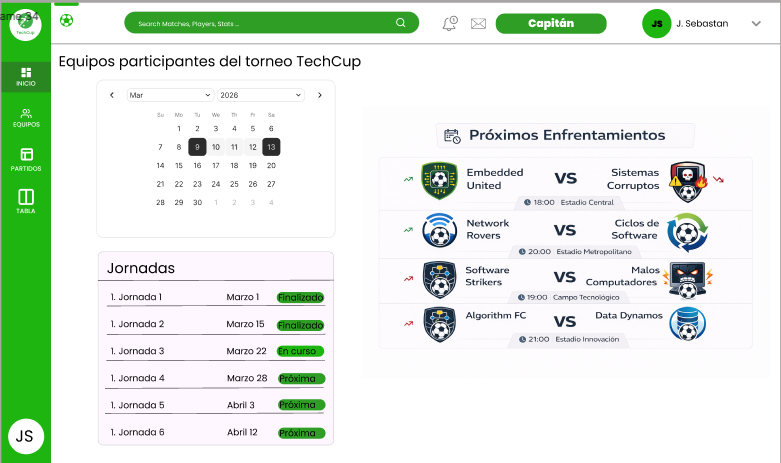

---

## Pantalla de Panel del Jugador:
Muestra el resumen personal del rendimiento del jugador, incluyendo goles, asistencias, tarjetas y partidos jugados. 
También presenta la posición actual en la tabla individual, los mejores del torneo, los próximos partidos del equipo 
y el menú lateral para navegar entre secciones.

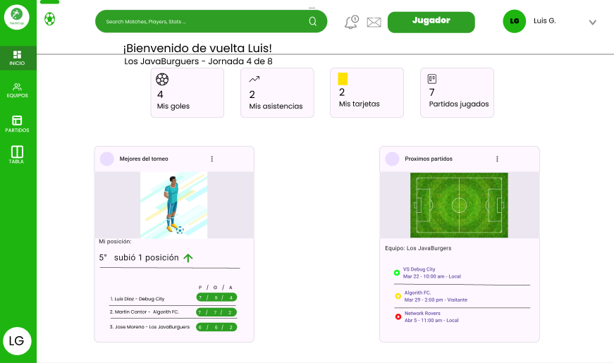

---

## Pantalla de Panel del Árbitro:
Presenta el resumen de actividad del árbitro, incluyendo partidos arbitrados, tarjetas mostradas y reportes pendientes. 
También muestra el último informe realizado y los próximos partidos asignados, junto con la navegación lateral y superior.

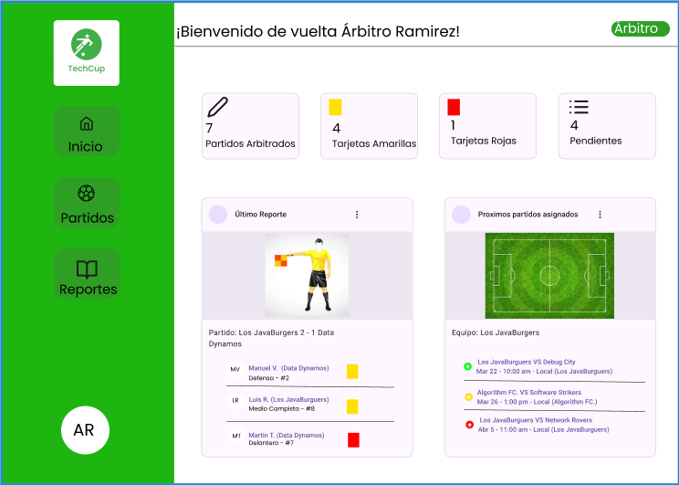

---
## Pantalla de Reporte en Curso:
Permite registrar y visualizar los eventos del partido, mostrando goles, tarjetas y observaciones relevantes. 
Incluye la información de los asistentes arbitrales y opciones para consultar el historial o cerrar y firmar el reporte del encuentro.

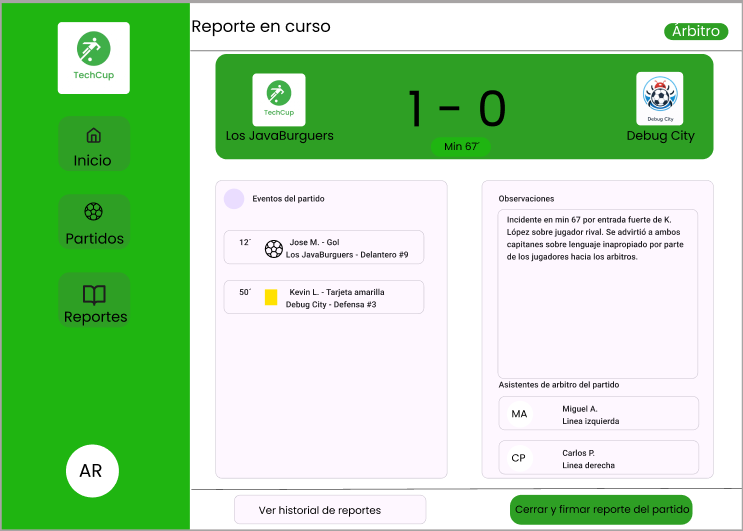

---

## Pantalla Principal del Organizador:
Muestra un panel general con información clave del torneo: próximos partidos, tabla de posiciones, equipos recién unidos y gestión rápida. 
También incluye accesos para crear nuevos torneos y administrar partidos, junto con un menú lateral y barra superior para navegación.

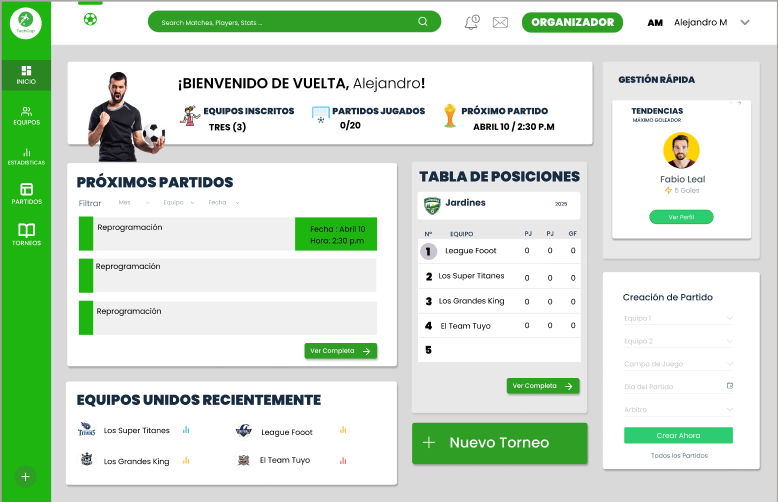

### Justificacion manual de identidad 
### Justificacion color principal verde

Identidad académica

El color verde está asociado al programa de Ingeniería de Sistemas, del cual forma parte el desarrollo del proyecto académico.
La utilización de este color permite establecer una conexión visual con la identidad del programa.
Relación con el deporte
El verde también es un color tradicionalmente asociado con el fútbol, ya que representa el campo de juego.
Por esta razón resulta adecuado para una plataforma dedicada a la organización de torneos deportivos.

### Justificacion tipografia 
Poppins fue seleccionada como tipografía principal de la plataforma TECHCUP Fútbol debido a sus características de diseño moderno y alta legibilidad en interfaces digitales.
Sus formas geométricas y equilibradas permiten mantener una apariencia clara y profesional dentro de la interfaz del sistema.
Además, es una tipografía ampliamente utilizada en aplicaciones web y kits de diseño

